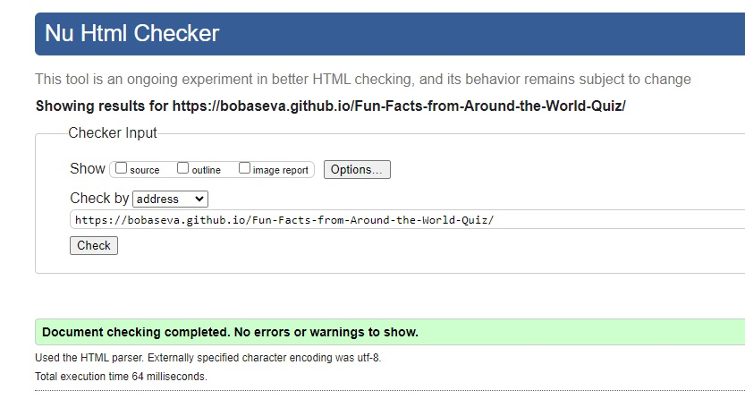

# Fun Facts from Around the World Quiz

[View deployed project here]( https://bobaseva.github.io/Fun-Facts-from-Around-the-World-Quiz/)
---

## Table of Contents

- [Fun Facts from Around the World Quiz](#fun-facts-from-around-the-world-quiz)
  - [View deployed project here](#view-deployed-project-here)
  - [Table of Contents](#table-of-contents)
  - [Introduction](#introduction)
  - [User stories](#user-stories)
  - [User goals](#user-goals)
  - [Design](#design)
    - [Colour Scheme](#colour-scheme)
    - [Typography](#typography)
    - [Imagery](#imagery)
    - [Wireframes](#wireframes)
    - [Homepage](#homepage)
    - [Name form](#name-form)
    - [Game area](#game-area)
  - [Features](#features)
    - [Logo](#logo)
    - [Buttons](#buttons)
    - [Favicon](#favicon)
    - [Modal box](#modal-box)
    - [Name form](#name-form-1)
    - [Game area](#game-area-1)
    - [Future Implementations](#future-implementations)
    - [Bugs and Challenges](#bugs-and-challenges)
  - [Programs and Applications](#programs-and-applications)
    - [Languages](#languages)
  - [Deployment](#deployment)
    - [Local Development](#local-development)
      - [How to Clone](#how-to-clone)
      - [How to Fork](#how-to-fork)
  - [Testing](#testing)
    - [HTML Validation](#html-validation)
    - [Performance](#performance)
    - [Accessibility](#accessibility)
    - [Manual Testing](#manual-testing)
  - [Credits](#credits)
    - [Code Used](#code-used)
    - [Content](#content)
    - [ Acknowledgments](#acknowledgments)

---

## Introduction

This game was developed for people who loves not only traveling but to collect memories, souvenirs, stories, and so much more. The best travelers are the ones who are not just tourists—they are the ones who have an unquenchable thirst for cultural experiences. This game aims to test the most unusual knowledgeabout different countries across the Globe.

## User stories

1. Color cheme and design of the game is not too bright and flashy as most of the game tends to be
2. Quiz topic seem to stand out from usual Travel quizes
3. Questions are interesting and unusual
4. Answers options are treaky what makes the game interesting

## User goals

1.	To be able to play the game on various devices
2.	To be able to see questions and asnwers quickly without wasting my time on trying to figure out the text
3.	To be able to know the remaining time
4.	Not to wait for any content to load longer than the rest of the page

## Design

This website is a single page platform, as the main priority is straightforward layout and clean design for more pleasant game experience.

### Colour Scheme

 

This colors were set by using color palette generator Coolors.co platform clearly showing very simple and pleasent to look at color choice for this game design.

### Typography

The google font ‘Montserrat’ was used for all text across the website. The font was imported from Google Fonts.

 

### Imagery

There is only one image used as a background and was downloaded from vecteezy.com Images and it was compressed through Shutterstock Image resizer in order to fit. Website logo was also downloaded from the same pltaform, while favicon was created in Canva Pro.

### Wireframes

### Homepage
 

### Name form
 

### Game area
 

## Features

### Logo

Located at the top of the page, it is the black and white picture of the Globe and it is in png format thus has transparent background creating very neat design serving its purpose and theme of the game.

### Buttons

All buttons of the game have the same design, they are responsive and change shade once hovered over.

### Favicon

Favicon icon was created as a different image from the logo in order to stand out from the grey background of the serach engines and to look more appealing for the game users.

### Modal box

MOdal box was created in order to avoin distraction from the game with the large amount of text for game instructions. The playes can click on the incstruction button in order to read the text and then go back to the homepage and continue with the game.

### Name form

Before proceeding to play the game the user must enter the name. It is not required to enter your true name, but rather is advised to be creative. The game won't strat unless the name is entered, the warning sign will appear otherwise.

### Game area

The game area consists of some encouraging text, timer, players Name and questions/answers of the quiz itself. Player gets 40 seconds to answer 10 questions by choosing one out of three options and clicking Next button to get to the next question.

### Future Implementations

Overall performance of the website can be improved by trying to upload background image of different size or format, as it can slow down the loading time. Also timer function can be updated in order to stop once the player clicked through all 10 questions, instead the timer goes on until it gets to 0 even if the player finished all the questions beforhand. All the options for the stop timer function I was able to find appeared to interfere with the existing code so it was decided to leave timer functions as it is for now.

### Bugs and Challenges

There were several bugs I came across while developing this game:

1. The favicon icon appeared not to load regardless of the way I was trying to upload it to the root directory. Both options were unsuccesfull to load the icon. I have tried option of copying the code from the website and uploading the whole folder to the directory and the one advised on Love Maths project with single line of code under the Title and single file upload. In the end the icon did appear on the deployed version of the website only, so it was deciced to leave it as it is.
2. Quiz questions functions bug was the most challenging as JS file stopped working when getting to the certain line fo the code, and from many more than 'first glance' JS code was perfectly fine on all line fo the file. After long time of research I managed to find the bug in the HTML file. As this version of repository was created as a copy of the first draft and most of the code was copied directly to the directory from the version that was created first, thus some lines were simply overwritten.
3. Also minor background bug was easily fixed. Background image appeared to move/shake everytime new button came up or ckicked on. First I tried to fix this issue with reducing borders of the buttons but later on I have managed to perfectly place the background with some extra css code.

## Programs and Applications

**GitHub** – storage and deployment 
**Codeanywhere** – IDE used to write, edit, commit and push the code to GitHub 
**Google Fonts** – import font 
**Shutterstock Image-resizer** – compress images 
**Favicon Generator Website** – create favicon 
**LucidApp** – wireframes design 
**Am I Responsive?** – check responsiveness of the website 
**Canva** – create logo 
**Coolors** – create colors palette 

### Languages

**HTML** 
**CSS** 
**JAVASRIPT**

## Deployment

The project was developed in CodeAnywhere application where it was committed and pushed to GitHub which was then committed and pushed to GitHub where it was deployed.

### Local Development

#### How to Clone

1. Log into your account on github
2. Go to the repository of this project /adrianskelton/Projecto1/
3. Click on the code button, and copy your preferred clone link.
4. Open the terminal in your code editor and change the current working directory to the location you want to use for the cloned directory.
5. Type 'git clone' into the terminal, paste the link you copied in step 3 and press enter.

#### How to Fork

To fork the repository:

1. Log in (or sign up) to Github.
2. Go to the repository for this project, adrianskelton/Projecto1
3. Click the Fork button in the top right corner.

## Testing

### HTML Validation

Every page of the website was validated using the W3C tool. 

### Performance

Website performance was checked with Lighthouse tool. 

### Accessibility

To check accessibility the Wave Web Accessibility Evaluation tool was used. 

### Manual Testing

Manual testing was done to check common elements and how they perform on different devices:

1.	Clicking on the main control buttons brings user to the aimed location
2.	Clicking on the Instructions buttons user was able to make Modal box appear
3.	User was able to make Modal box dissappear by clicking on the appropriate button
4.	User was able to submit his name into the form secton
5.	Users name appeared later alongside the game
6.	User was presented with the correct countdown timer for the game
7.	User was able to choose the answer and answer box was highlighted red/blue depending if the answer was correct
8.	User recieved his score once the time was out
9.	User was able to go back to the homepage after he finished the game

Following devices were used:

Laptop:
* Acer Aspire 5 A515-56
Mobile Devices:
* Samsung Galaxy Z Fold 4
* Google Pixel 6
  
Browsers:
* Google Chrome
* Firefox
* Safari

## Credits

### Code Used

1.	Basic files structure was built with the help of Math Project Challenge
2.	Several functions were created using Chat GPT and later adjusted to the needs
3.	Used Slack chat for any issues arising while developing the project
4.	The rest of the code was borrowed and modified mostly from stackoverflow.com and following sources:
    - <https://codepen.io/thingevery/pen/dyPrgwz>
    - <https://codewithcurious.com/projects/quiz-game-using-java>

### Content

All content was written and created by the developer.
  
###  Acknowledgments

My mentor Luke for continuous support and helpful feedback.